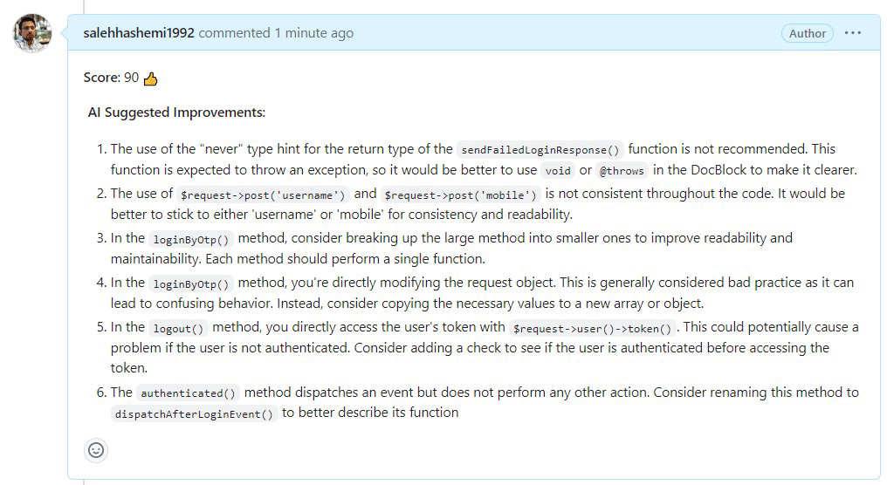
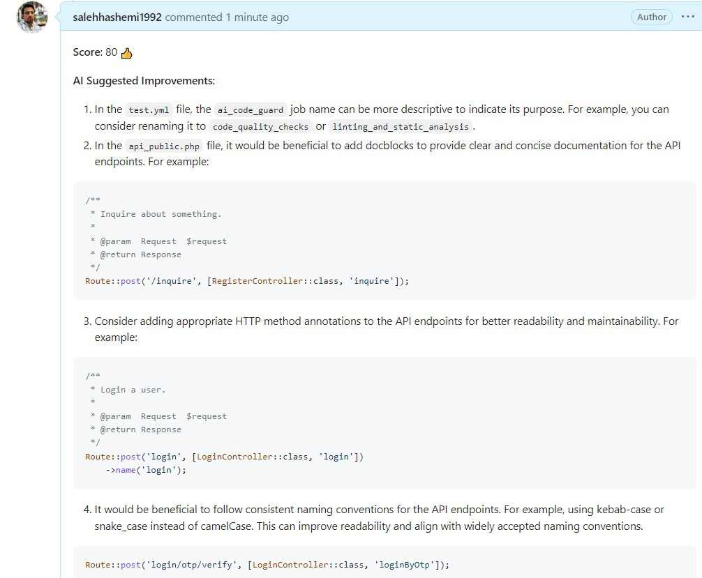

# AI Code Guard GitHub Action

AI Code Guard is a GitHub Action that uses AI to review pull requests and provide suggestions for improving code quality.

When you open or update a pull request labeled **"ai"**, this action will Post the suggestions as a comment on the pull request.

### Example Output



## Usage
To use this action in your GitHub repository, follow these steps:

1. In your GitHub repository, add a secret named `OPENAI_API_KEY` that contains your OpenAI API key.
2. Similarly, add a secret named `TOKEN` with your GitHub API token that grants access to the repository.
3. Add the following workflow file to your repository in the `.github/workflows` directory, and name it `ai_code_guard.yml`:

```yaml
on:
  pull_request:
    types: [synchronize, reopened, labeled]

jobs:
  ai-review:
    runs-on: ubuntu-latest
    permissions:
      contents: write
    steps:
      - name: Checkout repository
        uses: actions/checkout@v3
        with:
          fetch-depth: 0

      - name: AI Code Guard
        uses: salehhashemi1992/ai-code-guard@main
        with:
          github-token: ${{ secrets.TOKEN }}
          openai-api-key: ${{ secrets.OPENAI_API_KEY }}
          openai-model: 'gpt-4' # Optional, you can use 'gpt-3.5-turbo' or 'gpt-4-32k' as well.
          github-api-base-url: 'https://api.github.com' # Optional, defaults to 'https://api.github.com'
```

## Configuration

The action accepts the following inputs:

| Input          | Required | Description |
|----------------|-|-|
| `github-token`   | Yes | The GitHub API token for accessing the repository. |
| `openai-api-key` | Yes | The API key for accessing the OpenAI API. |
| `openai-model`   | No | Supported values are 'gpt-3.5-turbo', 'gpt-4', and 'gpt-4-32k'. Defaults to 'gpt-3.5-turbo'.|
| `api-base-url`   | No | The base URL for the GitHub API. Defaults to 'https://api.github.com'.|

### Limitations
Please note that AI is not perfect and should be used as a tool to assist in code review, not as a final decision-maker. Always review the suggestions made by the AI and apply your own judgement.

### Changelog

Please see [CHANGELOG](CHANGELOG.md) for more information what has changed recently.

## Contributing

Please see [CONTRIBUTING](CONTRIBUTING.md) for details.

## Credits

-   [Saleh Hashemi](https://github.com/salehhashemi1992)
-   [All Contributors](../../contributors)

## License

The MIT License (MIT). Please see [License File](LICENSE) for more information.